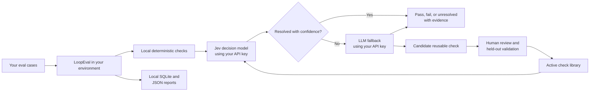

# LoopEval

LoopEval is a local-first evaluation framework for AI outputs and agent runs.
It combines deterministic checks, the Jev decision model, and an optional LLM
fallback in one cost-aware evaluation pipeline.

The core idea is simple: known failure modes should become reusable checks.
LoopEval sends routine judgments to Jev, sends only unresolved cases to the LLM,
and helps you turn repeated misses into reviewed, validated checks. As the check
library improves, fewer cases need the more expensive fallback.

LoopEval runs in your environment. You bring the provider keys, providers bill
your accounts directly, and evaluation records stay in your local storage.

> **Project status:** LoopEval v0.1 is intended for evaluation, regression
> testing, and controlled CI workflows. Calibrate thresholds on labeled examples
> before using model judgments for high-impact decisions.

## What you can evaluate

LoopEval accepts a small, general sample format that works for:

- LLM response quality and task completion
- RAG grounding and citation support
- policy and safety checks
- agent traces and tool-use behavior
- structured output validation
- regression suites in CI

Each sample can include an input, output, retrieved context, expected output,
agent trace, metadata, and application-specific data.

## How it works



For each case:

1. Local code handles exact checks such as JSON validity, required fields,
   regular expressions, length limits, and exact matches.
2. Applicable semantic checks are sent to Jev as typed Noul, Choice, or Score
   questions in one request.
3. LoopEval applies your thresholds to Jev's probabilities. Clear results stop
   there.
4. Uncertain, uncovered, audited, or provider-error cases can go to your chosen
   LLM for a structured verdict.
5. A novel recurring failure can become a candidate check. It must be reviewed
   and validated on labeled holdout data before activation.

LoopEval sends sample state and typed questions to the configured Jev provider.
Only escalated sample state is sent to the configured LLM provider. API keys are
read from environment variables and are not stored in reports or SQLite.

## Set it up with a coding agent

If you use Codex, Claude Code, Cursor, or another coding agent, start with the
[copy-paste integration prompt](docs/INTEGRATION_PROMPT.md). It guides the agent
through installation, sample mapping, initial checks, offline verification, and
provider setup without asking it to invent or store credentials.

## Five-minute local tour

Python 3.11 or newer is required.

```bash
git clone https://github.com/tbskin/loopeval.git
cd loopeval
python -m pip install -e .

loopeval init demo --offline
cd demo
loopeval doctor
loopeval run samples.jsonl
loopeval candidates
```

The offline project uses deterministic mock providers. It makes no network
requests and requires no API key. One sample deliberately exercises candidate
discovery so you can inspect the learning workflow.

## Run with Jev and an LLM

The default project template uses OpenRouter for both Jev and the fallback LLM:

```bash
loopeval init my-evals
cd my-evals
export OPENROUTER_API_KEY='your-key'
loopeval doctor
loopeval run samples.jsonl
```

The generated `loopeval.yaml` contains:

```yaml
providers:
  decision:
    type: openrouter_decisions
    model: typesafe/jev-1.13
    api_key_env: OPENROUTER_API_KEY
    input_cost_per_million: 0.042
    output_cost_per_million: 0

  fallback:
    type: openrouter
    model: openai/gpt-4.1-mini
    api_key_env: OPENROUTER_API_KEY
```

Provider prices can change. The price fields are configuration so historical
reports can retain the assumptions used for cost calculations. When a provider
returns an authoritative request cost, LoopEval records that value.

You can also use TypeSafe directly for Jev, OpenAI for the fallback, any
OpenAI-compatible fallback endpoint, or custom Python provider implementations.
See [provider configuration](docs/PROVIDERS.md).

## Add your evaluation cases

LoopEval reads JSON or JSONL:

```json
{
  "id": "refund-001",
  "input": "What is the refund window?",
  "output": "Refunds are available for 60 days.",
  "context": ["Refunds are available for 30 days."],
  "metadata": {"split": "test"}
}
```

Only `input` is required. Common optional fields are:

| Field | Purpose |
| --- | --- |
| `id` | Stable identifier used for caching, audits, and reports |
| `output` | Model or agent output to evaluate |
| `context` | Retrieved passages, policy text, or other evidence |
| `expected` | Reference answer or expected structured value |
| `trace` | Agent messages, tool calls, and tool results |
| `metadata` | Dataset split, model name, experiment id, or tags |
| `data` | Additional application-specific state |
| `labels` | Human labels used for candidate validation |
| `expected_verdict` | Optional expected overall result |

## Define checks

Checks are versioned YAML files that can be reviewed and committed with your
evaluation suite.

Use deterministic checks when code can calculate the answer exactly:

```yaml
id: output.valid_json
version: 1.0.0
name: Valid JSON output
description: The response must be valid JSON.
kind: deterministic
rule: json_valid
field: output
severity: critical
```

Built-in deterministic rules are `not_empty`, `exact_match`, `json_valid`,
`regex`, `max_length`, and `required_fields`.

Use a semantic check when the answer requires understanding language:

```yaml
id: grounding.unsupported_claim
version: 1.0.0
name: Unsupported claim
description: A material claim is unsupported by the supplied context.
kind: noul
requires: [context]
instructions: >-
  Does `output` make a material factual claim that is contradicted by, or
  absent from, `context`?
criteria:
  true: At least one material factual claim lacks support or conflicts with context.
  false: Every material factual claim is supported by context.
pass_threshold: 0.15
failure_threshold: 0.80
severity: critical
```

Noul checks represent the probability that a proposition is true. Choice checks
select from named criteria. Score checks use an ordered scale. Each check owns
its pass, fail, and uncertainty policy.

## Use the result in Python

```python
from loopeval import LoopEval

with LoopEval.from_config("loopeval.yaml") as evaluator:
    report = evaluator.run(
        [
            {
                "id": "example-1",
                "input": "Summarize the supplied policy.",
                "output": "The customer has 60 days to request a refund.",
                "context": ["Refund requests are accepted within 30 days."],
            }
        ]
    )

result = report.results[0]
print(result.verdict)
print(result.checks)
print(result.escalation_reasons)
print(report.total_cost_usd)
```

Use `await evaluator.arun(samples)` inside an async application.

An overall result is one of:

- `pass`: no active check or fallback found a material failure
- `fail`: at least one check or fallback found a material failure
- `unresolved`: the configured evidence or providers could not produce a safe
  pass or fail decision

## Grow the check library

A normal run stores novel candidate checks automatically. Activation is a
separate, guarded workflow:

```bash
loopeval candidates --status proposed
loopeval candidate cand_abc123

loopeval review cand_abc123 \
  --decision approve \
  --notes "Reusable failure with a clear boundary."

loopeval validate cand_abc123 holdout.jsonl
loopeval promote cand_abc123
```

The default promotion policy requires:

- at least 20 labeled examples
- precision of at least 0.90
- recall of at least 0.50
- resolved coverage of at least 0.80
- recorded human approval

Promotion writes a regular active YAML check under `checks/learned/`. The next
run loads it with the rest of the check library. Use `loopeval compare` on a
fixed dataset to verify the effect on accuracy, escalation rate, and cost.

See [the learning and promotion guide](docs/LEARNING_LOOP.md) for labeling and
review guidance.

## Storage, privacy, and cost control

LoopEval stores state under `.loopeval/` by default:

```text
.loopeval/
  loopeval.db
  runs/
    run_....json
    run_....jsonl
```

- There is no telemetry.
- Provider credentials are read from named environment variables.
- Evaluation records, evidence, cache entries, and candidates are stored locally.
- Network requests go only to the providers selected in `loopeval.yaml`.
- Provider choice is explicit. LoopEval does not silently switch providers.
- Per-sample timeouts, concurrency, state-size limits, fallback limits, and run
  cost budgets are configurable.
- Cache keys include provider identity, model, configuration, state, and questions.

Evaluated content is untrusted data. LoopEval bounds and fences content sent to
the fallback, requests structured output where supported, and validates provider
responses locally. Prompt injection cannot be eliminated through prompting
alone. Review the [security model](SECURITY.md) before evaluating sensitive data
or using results in high-impact workflows.

## Command reference

| Command | Purpose |
| --- | --- |
| `loopeval init` | Create configuration, starter checks, and sample data |
| `loopeval doctor` | Validate configuration, checks, directories, and key references |
| `loopeval run` | Run the complete evaluation pipeline |
| `loopeval report` | Read a stored run report |
| `loopeval compare` | Compare verdicts, escalation rate, and cost across two runs |
| `loopeval candidates` | List learned check candidates |
| `loopeval candidate` | Inspect one candidate, its evidence, and validation metrics |
| `loopeval review` | Approve or reject a candidate |
| `loopeval validate` | Evaluate an approved candidate on labeled holdout data |
| `loopeval promote` | Add a validated candidate to the active check library |
| `loopeval learn` | Rebuild candidate observations from a stored run |

Run `loopeval COMMAND --help` for complete arguments and options.

## License

LoopEval is licensed under the [Apache License 2.0](LICENSE).

You may use, modify, distribute, and commercially deploy LoopEval. If you
redistribute LoopEval or a modified version, retain the license and required
notices, and mark files you changed. The license includes an explicit patent
grant from contributors and provides the software without warranties or
conditions.

The LoopEval license covers this repository's code and documentation. Jev,
OpenRouter, OpenAI, and other external services have their own terms, licenses,
privacy policies, and usage charges. Bringing a provider key does not transfer
those services under the Apache license.

Contributions submitted to this repository are accepted under Apache 2.0.

## More documentation

- [Provider setup](docs/PROVIDERS.md)
- [Learning and promotion](docs/LEARNING_LOOP.md)
- [Architecture and invariants](docs/ARCHITECTURE.md)
- [Security policy and threat model](SECURITY.md)

If you want to contribute, start with [CONTRIBUTING.md](CONTRIBUTING.md). Coding
agents working on LoopEval itself should read [AGENTS.md](AGENTS.md) before
changing the package.
