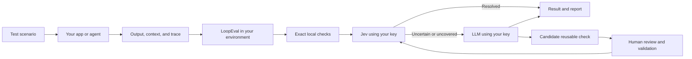

# LoopEval

LoopEval is a local-first evaluation framework for AI applications and agents.
It combines exact checks, the
[Jev decision model](https://docs.typesafe.ai/introduction), and an optional
large language model (LLM) fallback in one learning evaluation pipeline.

You provide representative application scenarios and describe what good behavior
means. LoopEval helps build the initial check library, sends routine semantic
judgments to Jev, and sends only uncertain or uncovered cases to the LLM. When
the LLM discovers a reusable failure category, it proposes a new check for human
review and held-out validation. Once promoted, future cases can use the cheaper
Jev path.

LoopEval uses a bring your own key (BYOK) model. It runs in your environment,
providers bill your accounts directly, and reports stay in local storage. Sample
content is sent only to the providers you configure.

> **Project status:** LoopEval v0.1 is intended for evaluation, regression
> testing, and controlled CI workflows. Validate model judgments against labeled
> examples before using them for high-impact decisions.

## Where LoopEval fits

LoopEval evaluates outcomes produced by your application. Your application or
test harness still runs the scenario. LoopEval receives the resulting input,
output, context, and trace, then determines whether that outcome passes your
evaluation policy.



Use LoopEval for:

- response quality and task completion
- retrieval-augmented generation (RAG) grounding and citation support
- agent traces and tool-use behavior
- policy and safety checks
- structured output validation
- local regression testing and CI

LoopEval is an outcome evaluator, not an application runner. You decide how to
invoke your app and which state should be captured for evaluation.

## Prerequisites

- Python 3.11 or newer
- representative scenarios or captured outputs from your application
- Jev access through either a
  [TypeSafe API key](https://console.typesafe.ai/) or an
  [OpenRouter API key](https://openrouter.ai/settings/keys)
- an LLM API key if you want unresolved cases categorized and candidate checks
  proposed

An OpenRouter key can provide both Jev and the fallback LLM. The default direct
setup uses `TYPESAFE_API_KEY` for Jev and `OPENAI_API_KEY` for the fallback. A
Jev-only configuration needs no LLM key, but it cannot run the complete learning
loop. The offline tour requires no credentials.

## Set it up with a coding agent

If you use Codex, Claude Code, Cursor, or another coding agent, copy the
[integration prompt](docs/INTEGRATION_PROMPT.md) into your application repository.
It guides the agent through finding an evaluation target, capturing scenarios,
configuring providers, bootstrapping checks, and verifying the integration.

## Install and initialize

Until the first package release, install from the repository:

```bash
git clone https://github.com/tbskin/loopeval.git
cd loopeval
python -m pip install -e .
```

Create an evaluation directory using direct TypeSafe and OpenAI credentials:

```bash
loopeval init evals --decision typesafe --fallback openai
cd evals

export TYPESAFE_API_KEY='your-typesafe-key'
export OPENAI_API_KEY='your-openai-key'

loopeval doctor
```

Or use one OpenRouter key for both roles:

```bash
loopeval init evals --decision openrouter --fallback openrouter
export OPENROUTER_API_KEY='your-openrouter-key'
```

See [provider setup](docs/PROVIDERS.md) for Jev-only, compatible endpoint, local
model, and custom Python configurations.

## Capture one application scenario

Call your application first, then pass the result to LoopEval:

```python
from loopeval import LoopEval
from my_app import answer_question

question = "What is the refund window?"
app_result = answer_question(question)

sample = {
    "id": "refund-window",
    "input": question,
    "output": app_result.text,
    "context": app_result.retrieved_documents,
    "trace": app_result.tool_trace,
    "expected": "The refund window is 30 days.",
}

with LoopEval.from_config("evals/loopeval.yaml") as evaluator:
    report = evaluator.run([sample])

result = report.results[0]
print(result.verdict)
print(result.checks)
print(result.escalation_reasons)
print(report.total_cost_usd)
```

Use `await evaluator.arun(samples)` inside an async application.

For file-based or CI runs, capture one JSON object per line:

```json
{"id":"refund-window","input":"What is the refund window?","output":"Refunds are available for 30 days.","context":["Refunds are available within 30 days."]}
```

Then run:

```bash
loopeval run scenarios.jsonl
```

The [refund assistant example](examples/refund_assistant) contains a complete
application, scenario-capture script, requirements file, checks, and provider
configuration.

## Build the initial check library

Write a short requirements file describing what the application must do. Then
ask the configured LLM to propose a focused initial library:

```bash
loopeval bootstrap \
  --requirements requirements.md \
  --scenarios scenarios.jsonl

loopeval candidates --status proposed
loopeval candidate cand_abc123
```

Bootstrap can propose exact checks from the built-in rule registry and semantic
checks for Jev. Its output is treated as untrusted. Proposed checks remain
inactive until a person reviews them and they pass labeled holdout validation.

Users should not normally need to hand-author semantic check YAML. Manual checks
remain available for exact application invariants and advanced customization.

## How each evaluation runs

For each sample:

1. Local code runs exact checks such as JSON validity, required fields, regular
   expressions, length limits, and exact matches.
2. Applicable semantic checks are sent to Jev as typed
   [Noul, Choice, or Score](https://docs.typesafe.ai/concepts/system-one)
   questions in one request.
3. LoopEval applies each check's thresholds to Jev's probabilities.
4. Uncertain, uncovered, audited, or provider-error cases can go to the selected
   LLM for a structured verdict.
5. A genuinely new reusable failure becomes an inactive candidate check.
6. Reviewed candidates are evaluated on labeled holdout data before promotion.

The overall result is:

- `pass`: no active check or fallback found a material failure
- `fail`: at least one check or fallback found a material failure
- `unresolved`: the available evidence or providers could not safely decide

## Sample format

Only `input` is required. Include enough state for the checks to judge the
application outcome.

| Field | Purpose |
| --- | --- |
| `id` | Stable identifier used for caching, audits, and reports |
| `input` | Scenario input or user request |
| `output` | Application, model, or agent output |
| `context` | Retrieved passages, policy text, or other evidence |
| `expected` | Reference answer or expected structured value |
| `trace` | Agent messages, tool calls, and tool results |
| `metadata` | Dataset split, model name, experiment id, or tags |
| `data` | Additional application-specific state |
| `labels` | Human labels used for candidate validation |
| `expected_verdict` | Human-labeled expected overall result |

## Advanced manual checks

Checks are versioned YAML files that can be reviewed and committed with an
evaluation suite.

An exact check uses a built-in local rule:

```yaml
id: output.valid_json
version: 1.0.0
name: Valid JSON output
description: The response must be valid JSON.
kind: deterministic
rule: json_valid
field: output
severity: critical
```

Built-in exact rules are `not_empty`, `exact_match`, `json_valid`, `regex`,
`max_length`, and `required_fields`.

A semantic check describes one narrow failure for Jev:

```yaml
id: grounding.unsupported_claim
version: 1.0.0
name: Unsupported claim
description: A material claim is unsupported by the supplied context.
kind: noul
requires: [context]
instructions: >-
  Does `output` make a material factual claim that is contradicted by, or
  absent from, `context`?
criteria:
  "true": At least one material factual claim lacks support or conflicts with context.
  "false": Every material factual claim is supported by context.
pass_threshold: 0.15
failure_threshold: 0.80
severity: critical
```

## Grow the library over time

Normal evaluation runs store novel candidates automatically. Promotion remains
a separate guarded workflow:

```bash
loopeval candidates --status proposed
loopeval candidate cand_abc123

loopeval review cand_abc123 \
  --decision approve \
  --notes "Reusable failure with a clear boundary."

loopeval validate cand_abc123 holdout.jsonl
loopeval promote cand_abc123
```

The default promotion policy requires:

- at least 20 labeled examples
- precision of at least 0.90
- recall of at least 0.50
- resolved coverage of at least 0.80
- recorded human approval

Promotion writes a regular active YAML check under `checks/learned/`. The next
run sends it to Jev with the rest of the active library. See the
[learning and promotion guide](docs/LEARNING_LOOP.md) for the full workflow.

## Storage, privacy, and cost

LoopEval stores local state under `.loopeval/` by default:

```text
.loopeval/
  loopeval.db
  runs/
    run_....json
    run_....jsonl
```

- There is no telemetry.
- Credentials are read from environment variables and are not persisted.
- Reports, cache entries, evidence, and candidate records stay local.
- Sample state sent for semantic checks goes to the selected Jev provider.
- Only escalated sample state goes to the selected LLM provider.
- Provider selection is explicit. LoopEval does not silently switch providers.
- Timeouts, concurrency, state-size limits, fallback limits, and cost budgets are
  configurable.

Evaluated content is untrusted data. LoopEval bounds and fences fallback input,
requests structured output where supported, and validates provider responses
locally. Prompt injection cannot be eliminated through prompting alone. Review
the [security model](SECURITY.md) before evaluating sensitive data or using
results in high-impact workflows.

## Offline tour

The offline project uses deterministic mock providers. It makes no network
requests and requires no key:

```bash
loopeval init demo --offline
cd demo
loopeval doctor
loopeval run samples.jsonl
loopeval candidates
```

Mocks demonstrate control flow only. They are not quality measurements.

## Command reference

| Command | Purpose |
| --- | --- |
| `loopeval init` | Create provider configuration, starter checks, and sample data |
| `loopeval doctor` | Validate configuration, checks, directories, and credentials |
| `loopeval bootstrap` | Propose initial checks from requirements and scenarios |
| `loopeval run` | Run the exact, Jev, and optional LLM cascade |
| `loopeval report` | Read a stored run report |
| `loopeval compare` | Compare verdicts, escalation rate, and cost across runs |
| `loopeval candidates` | List candidate checks |
| `loopeval candidate` | Inspect a candidate and its evidence |
| `loopeval review` | Approve or reject a candidate |
| `loopeval validate` | Evaluate an approved candidate on labeled holdout data |
| `loopeval promote` | Add a validated candidate to the active library |
| `loopeval learn` | Rebuild candidate observations from a stored run |

Run `loopeval COMMAND --help` for all arguments and options.

## License

LoopEval is licensed under the [Apache License 2.0](LICENSE).

You may use, modify, distribute, and commercially deploy LoopEval. If you
redistribute LoopEval or a modified version, retain the license and required
notices, and mark files you changed. The license includes an explicit patent
grant from contributors and provides the software without warranties or
conditions.

The LoopEval license covers this repository's code and documentation. Jev,
TypeSafe, OpenRouter, OpenAI, and other external services have their own terms,
privacy policies, and usage charges.

## More documentation

- [Provider setup](docs/PROVIDERS.md)
- [Learning and promotion](docs/LEARNING_LOOP.md)
- [Architecture and invariants](docs/ARCHITECTURE.md)
- [Security policy and threat model](SECURITY.md)

If you want to contribute, start with [CONTRIBUTING.md](CONTRIBUTING.md). Coding
agents working on LoopEval itself should read [AGENTS.md](AGENTS.md) first.
