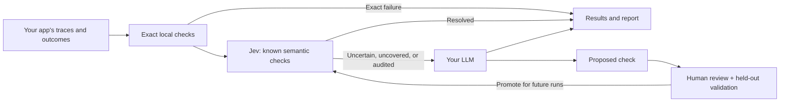

# LoopEval

Evaluate more traces without sending every judgment to an LLM.

LoopEval combines exact local checks, the
[Jev decision model](https://docs.typesafe.ai/introduction), and a large language
model (LLM) fallback. Routine language judgments go to Jev. Uncertain or uncovered
cases go to your chosen LLM, which can propose reusable checks. After human
review and validation, those checks join the next run's library.

LLM-as-judge evaluations can become expensive across a large volume of traces,
leading teams to sample instead. LoopEval aims to make evaluating every trace
affordable, with fewer cases needing the LLM as the check library grows. It
learns checks, not Jev's model weights.

The comparison is evaluation spend versus an LLM judge, not the cost of running
your app. Measure both cost at equal trace coverage and trace coverage at equal
budget. Inspecting 100% of traces does not guarantee finding every failure.

LoopEval is bring your own key (BYOK). It runs in your environment with no
LoopEval account or hosted service. Your model providers bill you directly.

> **Status: experimental, unreleased.** Install from source for now. Offline
> tests verify software behavior, not real-model accuracy, throughput, or savings.

**Setting this up with a coding agent?** Copy the
[integration prompt](docs/INTEGRATION_PROMPT.md) into your application's repository.

## Where it fits

Your app or test harness runs the scenario. LoopEval evaluates the captured
outcome, so the app can be written in any language. Use JSONL files or the Python
API for response quality, RAG grounding, structured outputs, and agent traces.



LoopEval evaluates every sample you submit. It does not collect production
traces or invoke your app automatically. You control capture and submission.
It accepts text and JSON state, not raw images, audio, or video. It currently has
a CLI and Python API, not a hosted dashboard.

## Prerequisites

- Python 3.11 or newer.
- Representative outputs from your app and a description of correct behavior.
- A Jev key from [TypeSafe](https://console.typesafe.ai/) or
  [OpenRouter](https://openrouter.ai/settings/keys).
- An LLM key for the learning loop, such as [OpenAI](https://platform.openai.com/api-keys),
  [Anthropic](https://console.anthropic.com/settings/keys), or OpenRouter.
  An OpenAI-compatible local model can replace this key.

OpenRouter is optional. Direct TypeSafe plus direct OpenAI is the default;
one OpenRouter key can also serve both roles. Jev-only mode is available without
LLM discovery. The offline tour below needs no keys.

## Install and try it without keys

From a source checkout, in a virtual environment:

```bash
git clone https://github.com/tbskin/loopeval.git
cd loopeval
python -m venv .venv
source .venv/bin/activate
python -m pip install -e .

loopeval init demo --offline
loopeval doctor --config demo/loopeval.yaml
loopeval run demo/samples.jsonl --config demo/loopeval.yaml
loopeval candidates --config demo/loopeval.yaml
```

On Windows PowerShell, activate with `.venv\Scripts\Activate.ps1` instead.
The generated mock examples produce one pass, one fail, and an inactive candidate.
They use synthetic markers to demonstrate routing. They do not test a real model.

## Connect your app

With LoopEval installed, run these commands from your app's repository root:

```bash
loopeval init evals --decision typesafe --fallback openai
export TYPESAFE_API_KEY='your-typesafe-key'
export OPENAI_API_KEY='your-openai-key'
loopeval doctor --config evals/loopeval.yaml
```

Set credentials in your shell or secret manager, never in committed files.
`init` creates configuration, starter checks, sample data, a requirements file,
and a local-state gitignore. Edit the generated requirements for your app.

For other routes, choose `--fallback anthropic`, `--fallback openai-responses`,
or `--decision openrouter --fallback openrouter` when initializing.
See [provider setup](docs/PROVIDERS.md) for all routes and local models.

When ready to make a small billable request to each configured provider:

```bash
loopeval doctor --live --config evals/loopeval.yaml
```

Replace `evals/samples.jsonl` with actual captured outcomes, one JSON object per
line. For example:

```json
{"id":"refund-window","input":"What is the refund window?","output":"Refunds are available for 30 days.","context":["Refunds are available within 30 days."]}
```

Then evaluate and save a detailed report:

```bash
loopeval run evals/samples.jsonl --config evals/loopeval.yaml --output evals/report.json
loopeval runs --config evals/loopeval.yaml
loopeval report RUN_ID --details --config evals/loopeval.yaml
```

Replace `RUN_ID` with an id from the run summary or `runs` listing. By default,
results live in `evals/.loopeval/`. Protect exported reports too: they may quote
sensitive application content.

For Python, pass the outcome after calling your app:

```python
from loopeval import LoopEval

# Fill these fields from your application's actual result.
sample = {
    "input": "What is the refund window?",
    "output": "Refunds are available for 30 days.",
    "context": ["Refunds are available within 30 days."],
}
with LoopEval.from_config("evals/loopeval.yaml") as evaluator:
    report = evaluator.run([sample])

print(report.results[0].verdict)
print(report.results[0].checks)
```

Use `await evaluator.arun(samples)` in async code. The
[refund assistant example](examples/refund_assistant) shows application capture
end to end. See [usage and sample fields](docs/USAGE.md) for integration details.

## Build and grow your check library

You describe correct behavior and supply representative scenarios. The LLM
proposes the initial checks, so you do not need to author semantic YAML first:

```bash
loopeval bootstrap --requirements evals/requirements.md \
  --scenarios evals/samples.jsonl --config evals/loopeval.yaml
loopeval candidates --status proposed --config evals/loopeval.yaml
```

Normal evaluation runs also save proposals when the fallback discovers a novel
failure. Discovery is automatic; activation is deliberately separate. The
fallback's answer is not ground truth.

Inspect a candidate, review it, validate it on distinct human-labeled examples,
then promote it. The default gate requires 20 examples, including positive and
negative cases, precision of 0.90, recall of 0.50, and resolved coverage of 0.80.
Promotion writes a versioned check file that future runs load automatically.

The [learning guide](docs/LEARNING_LOOP.md) has the complete commands and label
format. Manual [exact and semantic checks](docs/CHECKS.md) remain available for
application invariants and advanced customization.

## Understand the result

- `pass`: the applied checks or fallback found no material failure.
- `fail`: a check or fallback found a failure, or you chose fail-closed behavior.
- `unresolved`: uncertainty, missing evidence, provider failure, or a budget
  limit prevented a decision.

Check results also expose `skipped` and `error`. A skipped check supplies no
assurance about that dimension. Inspect check coverage, not just the overall
verdict. Starter checks are examples, not a complete policy for your app.

For CI, opt into failing the command on failed or unresolved samples:

```bash
loopeval run evals/samples.jsonl --config evals/loopeval.yaml \
  --fail-on fail,unresolved --junit evals/reports/loopeval.xml
```

Exit code `3` means a configured evaluation gate failed after the report was
saved. Without gates, a completed run exits `0` even when samples fail.
See [CI and exit codes](docs/CI.md).

## Measure the benefit

Compare LoopEval with an LLM judging the same evaluation policy on every trace.
Then compare it with that LLM judging a budget-limited sample, such as 1%, 5%,
or 10% of traces. Those are experiment settings, not an industry-wide baseline.
Track spend, traces evaluated, false positives, missed failures, unresolved
results, and throughput. Report the traces never sampled separately from the
traces evaluated incorrectly.

Use human labels to measure quality before and after promoting checks.
Run the same frozen dataset with `--no-cache` when comparing request costs.
See [measurement and calibration](docs/CALIBRATION.md) for the experiment design.

Cost is `null` when usage or prices are incomplete. A cache hit costs zero new
provider calls, not zero original computation. More checks can increase Jev's
input cost; bootstrap, validation, and audits also cost money. See
[configuration and budgets](docs/CONFIGURATION.md) before a large run.

## Privacy and license

There is no telemetry or required LoopEval server. BYOK credentials are read
from the environment and not persisted. Sample content goes to the providers
you configure, including the LLM during bootstrap and escalations. Reports,
caches, and candidate evidence stay on your machine. Read the
[security policy](SECURITY.md) before using sensitive data.

LoopEval is licensed under [Apache-2.0](LICENSE), including commercial use,
subject to its terms. External models and services have their own terms and
usage charges.

## Contributing

Start with [CONTRIBUTING.md](CONTRIBUTING.md). For a coding agent working on
LoopEval itself, point it at [AGENTS.md](AGENTS.md) and the
[architecture guide](docs/ARCHITECTURE.md). Integration instructions for your
own app are in the [integration prompt](docs/INTEGRATION_PROMPT.md).
