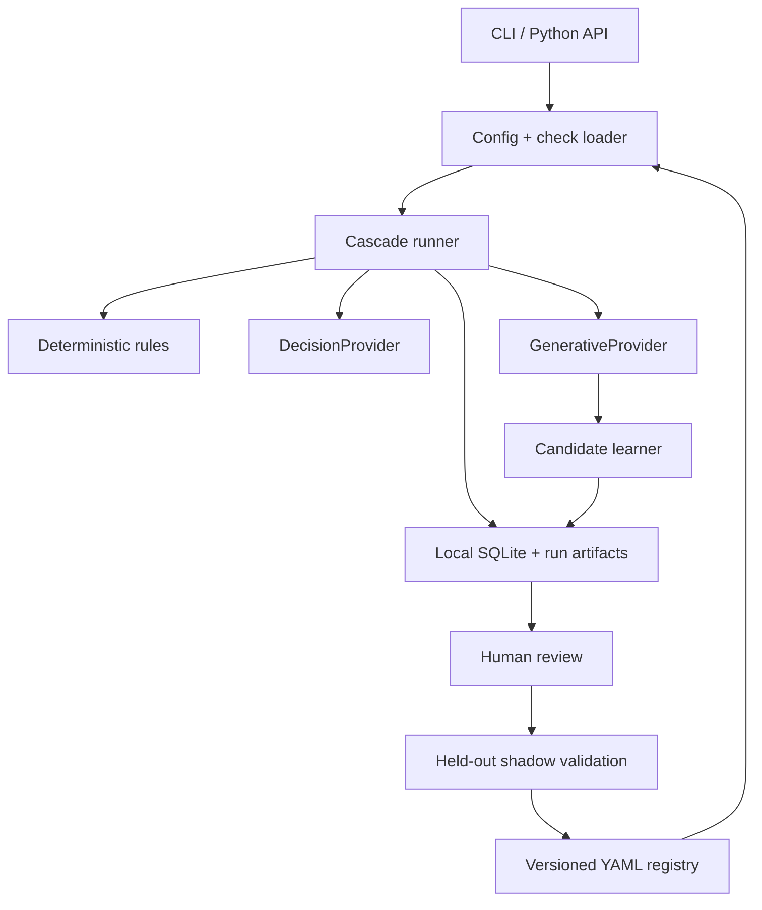

# Architecture and invariants

## Components

## Stable boundaries

### Sample boundary

`EvalSample` is provider-independent. Common fields are first-class; arbitrary
domain state lives under `data`. A check may declare `requires` fields and is
skipped when evidence is missing rather than guessing.

Human `labels` and `expected_verdict` are retained for local metrics and are
excluded from provider state.

### Check boundary

`CheckSpec` is provider-independent and versioned. Deterministic rules refer to
registered local functions. Semantic checks compile into one of three typed
questions: Noul, Choice, or Score.

### Provider boundary

`DecisionProvider` consumes a state and typed questions. `GenerativeProvider`
consumes messages and a JSON schema. Providers do not make routing or promotion
decisions.

### Storage boundary

SQLite is local provenance, not a required server. Complete run reports are also
written as JSON and JSONL so results remain portable if the storage engine changes.

## Core invariants

1. Deterministic checks always run before network calls.
2. Missing evidence yields `skipped`, never an invented pass.
3. Every semantic question asks one narrow failure-oriented judgment.
4. Applicable semantic checks share one decision request per sample.
5. Batched request usage is counted once.
6. Uncertainty is an explicit result, not silently coerced to pass or fail.
7. Provider failure cannot remove earlier results.
8. The fallback receives untrusted data in a randomized, bounded fence.
9. Provider output is untrusted and Pydantic-validated.
10. A generative provider cannot activate its own proposed check.
11. Promotion requires review and held-out evidence unless a user explicitly forces it.
12. Model aliases should not be used for calibrated production thresholds.
13. Audit sampling is deterministic by sample id.
14. Secrets are read only from environment-variable references.
15. Repeated observations can add candidate evidence but cannot rewrite the
    candidate definition that a person reviewed or validated.

## Verdict aggregation

- Any known check failure makes the sample fail.
- A fallback `existing_failure` or `novel_failure` makes it fail.
- A fallback `acceptable` passes only when no known check already failed.
- An unresolved escalation produces `unresolved` by default.
- `fail_closed_without_fallback` changes unresolved escalations to failure.

This precedence prevents a broad fallback from overruling exact local evidence.

## Unknown detection

No model reliably knows everything it does not know. LoopEval therefore combines:

- per-check uncertainty bands;
- Choice `uncertain`/`other`/`insufficient_evidence` labels;
- missing or malformed provider answers;
- an explicit uncovered-material-issue question;
- absence of any applicable check;
- decision-provider errors;
- deterministic random audits.

Future novelty signals can be added, but none should replace random audits and
human-reviewed outcome data.

## Failure behavior

The evaluator is fail-observable:

- provider errors are recorded as check errors and escalation reasons;
- a missing fallback leaves an unresolved verdict instead of silently passing;
- disabled or budget-exhausted fallbacks are explicit escalation reasons;
- fallback budgets stop additional expensive-tier calls without skipping exact
  checks;
- every completed run persists configuration identity and full per-sample results.
